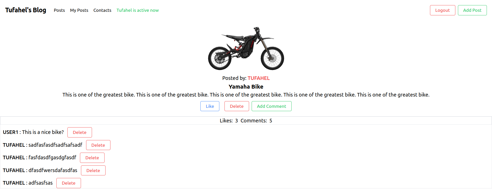

# Blog App Front End

> The Blog app is a classic example of a blog website. It is a fully functional website that will show the list of posts and empower readers to interact with them by adding comments and liking posts.

## Demo Pic
- All Posts

- My Posts

- Post Details

## Back-End Repo
[Backend Repo](https://github.com/Tufahel/blog-app-ror)

## Live App
- Live app: [Blog App](https://euphonious-semolina-b80229.netlify.app/)

## Built With
- React
- Redux
- RestAPI
- JSX
- TailwindCSS

## Getting Started

To get a local copy up and running follow these setup steps.

**Setup**

- Open terminal and clone the project: `git clone git@github.com:Tufahel/blog-app-front-end.git`
- cd into the directory `blog-app-front-end`

**Prerequisites**

- You need to have `node.js` installed in your system

**Install**

- On your terminal run : `npm i`
- To run the app in the development mode : `npm start`
- Launch the test runner : `npm test`
- In case you run into any errors please raise an [issue](https://github.com/Tufahel/blog-app-front-end/issues).

## Author

👤 **Tufahel Ahmed**

- GitHub: [@Tufahel](https://github.com/Tufahel)
- Twitter: [@TufahelAhmed](https://twitter.com/TufahelAhmed)
- LinkedIn: [@Tufahel-Ahmed](https://www.linkedin.com/in/tufahel-ahmed/)

## 🤝 Contributing

Contributions, issues, and feature requests are welcome!

Feel free to check the [issues page](https://github.com/Tufahel/blog-app-front-end/issues)

## Show your support

Give a ⭐️ if you like this project!

## 📝 License
This project is [MIT](https://github.com/microverseinc/readme-template/blob/master/MIT.md) licensed.
